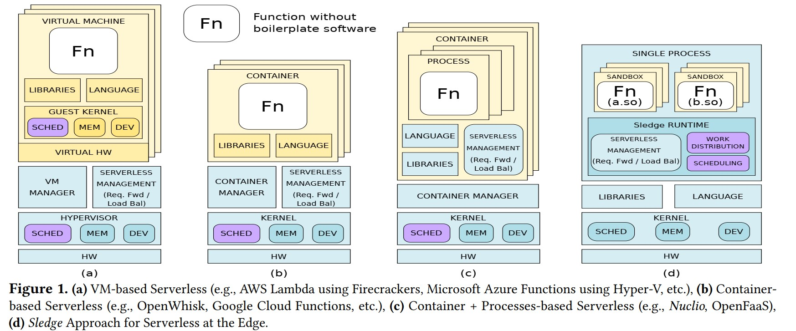

# Sledge: a Serverless-first, Light-weight Wasm Runtime for the Edge

[Middleware'20](https://dl.acm.org/doi/abs/10.1145/3423211.3425680), [github](https://github.com/gwsystems/sledge-serverless-framework)

<!-- omit in toc -->
## Table of Contents

- [1. 相关背景](#1-相关背景)
- [2. 具体工作](#2-具体工作)
- [3. 实验设计](#3-实验设计)

## 1. 相关背景

服务器无感知的两种底层经典实现机制：

- 基于 VM：
  - 传统虚拟机 GB 级别 memory 开销
  - Amazon Firecracker：5MB 内存占用，125ms 启动时延
- 基于 container：存在不同的实现模式
  - 一个 container 启动一个 function（语言和依赖库之间相互隔离）
  - 一个租户使用一个 container，容器内部产生多个 function 进程（共用容器内部的语言、依赖库）
    - Nuclio 为 k8s 中表现最好的 faas 平台

但这些机制对于 FaaS 而言仍然具有较大的开销，或者无法在函数级别实现较好的资源共享存在较大的资源浪费的情况。本文针对这一情况设计了基于 wasm 实现的 FaaS 平台：

- 基于动态运行库的机制，将运行库的链接和加载与函数的实例化进行解耦，实现**函数隔离**和动态运行库的共享
- 利用 wasm 线性内存、控制流完整性等机制实现 faas 平台的安全机制
- 基于用户态调度（绕过内核的调度机制）、工作窃取队列实现工作负载均衡

## 2. 具体工作

- language runtime 和 library 在 Sledge 中被所有的函数共享（运行时的链接和加载，与函数的实例化过程解耦）
- 可自定义的内存边界检查方式：不进行显式检查、基于软件的边界检查、基于硬件的边界检查、基于架构消除边界检查
- 使用单一进程作为函数的隔离保护域：减少函数间进行通信带来的进程间通信开销（IPC）、语言运行时和依赖库的重复加载
- 在用户空间实现任务调度，避免状态切换导致的开销
  - 通过工作窃取队列实现工作节约、避免队头阻塞的任务调度方法
  - 区别全局队列和每个 core 的分离队列，保证了任务调度的 **scalable** 和 **work-conservation**

Sledge 实现的挑战：

- 操作系统内核的阻塞，导致所有用户级线程的阻塞
  - 利用每一个 cpu 核的定时器进行抢占式调度，结合事件驱动的 IO 库实现阻塞的避免
- 协同计算对不可信计算（执行时间没有上界）的非弹性

webassembly 隔离机制安全机制的相关背景：

- 内存安全：线性内存模型，保证沙箱内部逻辑不会影响沙箱外部内存和控制
- 控制流完整性：数据堆栈和执行堆栈分离，实现执行堆栈在线性内存外保存，避免控制流劫持的发生

边界检查的几种实现配置：

- 不提供显式的边界检查：可以用于比较边界检查的开销
- 基于软件的边界检查
- 基于硬件的边界检查
- 基于架构的优化：为每一个沙箱提供固定大小的虚拟内存空间，通过虚拟内存页错误保证沙箱的内存安全

本文的最突出的亮点体现在对 faas 不同实现机制的讨论。本文基于 wasm 实现函数的隔离，可以将其看作是动态运行库层级的虚拟机，具体和其他 faas 实现机制的不同在下图中进行了展示：

- 其中，浅蓝色的方框表示在可以被不同的函数共享的资源
  - 但是这些资源可能在不同的层面进行共享（host 级别 / container 级别）
- 黄色的方框表示被函数独占的资源

## 3. 实验设计

实验过程中采用的 benchmark：[the Polyhedral Benchmark suite](https://web.cse.ohio-state.edu/~pouchet.2/software/polybench/)

实验过程中采用的 baseline：

- [wasmer](https://wasmer.io/)
  - Cranelift 编译器：启用 JIT 编译产物的缓存，提升性能
- [wavm](https://wavm.github.io/)
  - LLVM 编译器：启用 JIT 编译产物的缓存，提升性能
- [lucet](https://github.com/bytecodealliance/lucet)（现已迁移至 [Wasmtime](https://wasmtime.dev/)）
- Node.js + Emscripten: 生成 Javascript 包装器
- Sledge+aWsm-mpx：使用 Intel MPX，完成基于硬件的边界检查
- Sledge+aWsm-bounds-chk：基于软件完成边界检查
- Sledge+aWsm-rpi：基于虚拟内存的机制保证内存安全

baseline 的一些 insight：

- 基于 Cranelift 的运行时（Wasmer、Lucet）显著慢于原生运行
- 基于 LLVM 的 JIT 编译器运行时（WAVM）是其他运行时中表现最好的
- 基于软件/硬件实现边界检查都显著增加运行开销（甚至硬件相较软件增加更多开销）
- 基于虚拟内存机制实现内存安全，其开销可以忽略不计（仅仅略低于不进行内存检查的 baseline）

Nuclio 让一个租户在一个容器中执行，在容器内部通过 fork 创建函数，可以让容器持久化

- Sledge 和 Nuclio 的比较，本质上是 Sledge 沙箱的执行和原生系统 fork + exec 的比较
- 减少了对操作系统内核 trace 和 replicate 的操作

<!-- omit in toc -->
## Reference

- compared to Nuclio [57], one of the fastest open-source serverless frameworks.
- Recently, WebAssembly (Wasm) [33] with its light-weight sandboxing capabilities has emerged as a promising approach for supporting serverless at the Edge [23, 28, 34, 70].
- to show an average performance overhead within 13% of the native code execution for PolyBench/C [62] benchmarks and compare its efficiency with various existing LLVMand Cranelift-based [19] Wasm compilers and runtimes.
- Figure 1(c) depicts the next evolution step in implementing the serverless infrastructures by using a process per function, while maintaining a container per tenant, such as the latest Nuclio [57] and OpenFaaS [60] runtimes
- Given that the Nuclio platform [57] demonstrates the best results among the Kubernetes-based serverless solutions considered in [46], we choose Nuclio as the baseline against which we compare performance of Sledge.
- Multiple papers [1, 2, 42, 77] show that, while typically, function performance correlates with a memory size, it often exhibits inconsistent behavior.
- Wasm provides a light-weight sandboxing capabilities which can be utilized by running serverless functions at the Edge as shown by newly introduced commercial products (in 2019) from Cloudflare [70, 75] and Fastly [3, 4, 23], and research publications [14, 28, 34, 87]
- Boucher, et al [14] suggest a novel design for serverless platforms that runs usersubmitted microservices within shared processes.
- Hall, et al [34] demonstrate the potential of a Wasm-based approach to significantly decrease the cold-start latencies (under 30 ms in their implementation), while Fastly has announced that Lucet [4] (Fastly’s native WebAssembly compiler and runtime) can instantiate Wasm modules in under 50 𝜇sec [3].
- In our earlier paper [28], we discuss a set of open challenges and promising opportuinities for serverless computing at the Edge.
- the ARM v8 processors have gained significant traction in the Cloud and Edge computing worlds for their performance characteristics [10, 64].
- These characteristics make Nuclio one of the most attractive open-source serverless solutions for the Edge [46]
